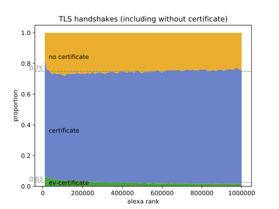

<!-- .slide: data-state="no-toc-progress" --> <!-- don't show toc progress bar on this slide -->

# CERTIFICATE TRANSPARENCY DEPLOYMENT STUDY
<!-- .element: class="no-toc-progress" --> <!-- slide not in toc progress bar -->

## CT-Unterstützung von Webservern

[Theodor Nolte](https://github.com/theno) | 2017-12-14 | [online][1] | [1page][2] | [src][3]

__[Ausarbeitung][4]__

[1]: https://theno.github.io/presi-ct-deployment
[2]: https://github.com/theno/presi-ct-deployment/blob/master/slides.md
[3]: https://github.com/theno/presi-ct-deployment
[4]: https://github.com/theno/presi-ct-deployment/blob/master/certificate-transparency-deployment-study.pdf

----  ----

# Grundlagen

----

<!-- .slide: data-state="no-toc-progress" --> <!-- don't show toc progress bar on this slide -->

## Web-PKI

* CA-Browser-Forum
* CAB-Requirements

----

<!-- .slide: data-state="no-toc-progress" --> <!-- don't show toc progress bar on this slide -->

----

<!-- .slide: data-state="no-toc-progress" --> <!-- don't show toc progress bar on this slide -->

----

<!-- .slide: data-state="no-toc-progress" --> <!-- don't show toc progress bar on this slide -->

----

<!-- .slide: data-state="no-toc-progress" --> <!-- don't show toc progress bar on this slide -->

----

## Certificate Transparency (CT)

----

<!-- .slide: data-state="no-toc-progress" --> <!-- don't show toc progress bar on this slide -->

### Idee: Öffentliche Kontrolle

* Alle Zertifikate werden in CT-Logs veröffentlicht
* Jeder kann Zertifikate einsehen

Bedingung:

* CT-Logs können nicht manipuliert werden

----

<!-- .slide: data-state="no-toc-progress" --> <!-- don't show toc progress bar on this slide -->

----

<!-- .slide: data-state="no-toc-progress" --> <!-- don't show toc progress bar on this slide -->

----

### Merkle Audit Proof

Certificate published?

----

<!-- .slide: data-state="no-toc-progress" --> <!-- don't show toc progress bar on this slide -->

----

<!-- .slide: data-state="no-toc-progress" --> <!-- don't show toc progress bar on this slide -->

### Merkle Consistency Proof

Log works correctly?

----

<!-- .slide: data-state="no-toc-progress" --> <!-- don't show toc progress bar on this slide -->

 <!-- .element height="35%" width="35%" -->

----

## Chromium / Chrome

* kein Auditor
* verifiziert SCTs
* mindestens zwei verschiedene CT-Log-Operatoren

----

## Zertifikate Veröffentlichen

----

### Zertifikat ausstellen und verwenden

### Ohne CT

----

<!-- .slide: data-state="no-toc-progress" --> <!-- don't show toc progress bar on this slide -->

----

<!-- .slide: data-state="no-toc-progress" --> <!-- don't show toc progress bar on this slide -->

### Zertifikat ausstellen und verwenden

 * by cert | SCT im Zertifikat enthalten
 * by tls  | SCT per TLS-Extension
 * by ocsp | SCTs per OCSP-Stapling

----

<!-- .slide: data-state="no-toc-progress" --> <!-- don't show toc progress bar on this slide -->

----

<!-- .slide: data-state="no-toc-progress" --> <!-- don't show toc progress bar on this slide -->

----

<!-- .slide: data-state="no-toc-progress" --> <!-- don't show toc progress bar on this slide -->

----

## Zusammenfassung

* Idee von CT: Öffentliche Kontrolle aller Zertifikate der Web-PKI

* CT-Komponenten
  * Log: Manipulation verhindert durch Merkle Tree
  * Monitor -> Consistency Proof (CT-Log okay?)
  * Auditor -> Audit Proof (Zertifikat in CT-Log enthalten?)

----

## Zusammenfassung

* Zertifikat veröffentlichen
  * SCT | "Veröffentlichungsquittung"

* Webseiten-Aufruf / TLS-Handshake
  * by cert
  * by tls
  * by ocsp

----  ----

# Vorgehen und Implementierung

----

## Vorgehen

* Domain-Namen: Alexa Top-1M (w/wo. 'www'-Präfix)
* TLS-Handshake: Webserver-Zertifikate abrufen
* SCTs abrufen

----

## Implementierung

----

## [ctutlz](https://github.com/theno/ctutlz)

* TLS-Handshake, "ernten":
  * Zertifikat / Chain
  * SCTs

* Verify der SCTs

----

## ctutlz

* Mühsame Umsetzung / Viele Fehlschläge
  * Modul 'ssl' aus Python-stdlib
  * m2crypto
  * pyOpenSSL
  * OpenSSL

----

## ctutlz

* Erste Implementierung in Python
  * OpenSSL nativ als Lib

* Verwendet pip-packages
  * pyopenssl / cryptography / cffi
  * pyasn1 / pyasn1-modules

* Verify von SCTs: Ducktyping von pyopenssl

----

## ctstats

* Erhebung: Über Alexa-Domain-Liste iterieren
* Ergebnisse in DB speichern
* Auswertung erstellen

----

## ctstats

Limitierungen:
* Maximale Anzahl Threads
* RAM
* Platten-Schreibgeschwindigkeit

----

## ctstats

* Iterieren - Wegschreiben - Iterieren - Wegschreiben - ...
* Thread-Pool Prozesse
* Anzahl:
  * Chunk-Size je Iteration: 10000
  * Thread-Pool Prozesse: 2000
    * max. 150 gleichzeitig
  * Threads: 5
  * RAM-Limit: 60 Prozent

----

## ctstats

* 4 GB RAM
* "normale" HD
* 33:12 h benötigt für einen Durchlauf
* 9273 MB in DB geschrieben

----  ----

# Ergebnisse

----

## Erhebung

* Ende September
  * Alexa-Top1M-List vom 2017-09-28
  * Scrape: vom 28ten bis 29ten

* kein signifikanter Unterschied zwischen w/wo. www-Präfix

----

## TLS Handshake Tries

|                     |  count  | percent |
| :------------------ | ------: | ------: |
| all                 | 2000000 |  100.00 |
| timeout             |  223868 |   11.19 |
| no certificate      |  446313 |   22.32 |
| certificate (no ev) | 1283926 |   64.20 |
| ev certificate      |   45893 |    2.29 |

----

## TLS Handshake Tries

----

## TLS Handshakes

----

## Verifications of SCTs

|                           |  count  | percent |
| :------------------------ | ------: | ------: |
| all                       | 1038227 |  100.00 |
| verified                  | 1015784 |   97.84 |
| unverified; ctlog known   |   22401 |    2.16 |
| unverified; ctlog unknown |      42 |    0.00 |

----

## SCTs by Deliver Way

|                  |  count  | percent |
| :--------------- | ------: | ------: |
| all              | 1038227 |  100.00 |
| by-cert          |  865852 |   83.40 |
| by-tls-extension |  172099 |   16.58 |
| by-ocsp-response |     276 |    0.03 |

----

## SCTs by deliver way

----

## SCTs of EV-Certificates by Deliver Way

|                  | count  | percent |
| :--------------- | -----: | ------: |
| all              | 134205 |  100.00 |
| by-cert          | 133932 |   99.80 |
| by-tls-extension |    141 |    0.11 |
| by-ocsp-response |    132 |    0.10 |

----

## SCTs of EV-Certificates by Deliver Way

----

<!-- .slide: data-state="no-toc-progress" --> <!-- don't show toc progress bar on this slide -->

## Certificates with or without SCTs

|                |  count  | percent |
| :------------- | ------: | ------: |
| all            | 1329819 |  100.00 |
| no SCTs        |  990221 |   74.46 |
| 1 or more SCTs |  339598 |   25.54 |
| 1 SCT          |      53 |    0.00 |
| 2 SCTs         |  111717 |    8.40 |
| 3 SCTs         |  130358 |    9.80 |
| 4 SCTs         |   63970 |    4.81 |
| 5 or more SCTs |   33500 |    2.52 |

----

## Certificates with or without SCTs

----

## Certificates with SCTs

----

## EV-Certificates with or without SCTs

----

## EV-Certificates with SCTs

----

<!-- .slide: data-state="no-toc-progress" --> <!-- don't show toc progress bar on this slide -->

## SCTs by CT-Log

----

<!-- .slide: data-state="no-toc-progress" --> <!-- don't show toc progress bar on this slide -->

 <!-- .element height="90%" width="90%" -->

----

## SCTs by CT-Log

----

## SCTs by CT-Log-Operator

----

## SCTs by CT-Log-Operator

----

## Certificates with SCTs by CT-Log

----  ----

# Zusammenfassung und Ausblick

----

## Zusammenfassung

* 75 % der HTTPs-Webseiten unterstützen kein CT
* SCT by-OCSP wird praktisch nicht eingesetzt
* Diversität verbesserungswürdig
* Google dominiert und setzt durch:
  * Entwicklung / RFCs
  * Deployment / Chrome

----

## Ausblick

* Ab April 2018: CT erforderlich unter Chromium / Chrome
  * Zeitlicher Verlauf vom Deployment

* Weitere Untersuchungen
  * Details, z.B. verify-fails by-cert
  * Kombinationen der SCTs-Auslieferungsmechanismen

* Abgleich: Zertifikate in CT-Logs veröffentlicht, zu TLS-Handshakes
  ohne CT-Unterstützung

----

## References

* ctutlz: https://github.com/theno/ctutlz

----  ----

<!-- .slide: data-state="no-toc-progress" --> <!-- don't show toc progress bar on this slide -->

### *Thank You for Your attention!*
<!-- .element: class="no-toc-progress" -->

---

__[revealjs_template](https://theno.github.io/revealjs_template) <-- ***check this out***__
